# 📋 Orchestration Report - Wave 2 (Performance)

**Data de criação:** 2025-11-18
**Orquestrador:** Claude Code
**Onda:** Wave-2 (Otimizações de Performance)
**Status:** ✅ Planejamento Completo, Pronto para Deployment

---

## 📊 Sumário Executivo

### Contexto

Este relatório documenta a orquestração completa da **Wave-2 de desenvolvimento paralelo** do projeto APP_SLIDE_OBA, focada em **otimizações de performance** identificadas na análise detalhada (PERFORMANCE-ANALYSIS.md).

### Objetivo da Onda

Implementar otimizações críticas para:
- ✅ **Reduzir tempo de geração em 40-50%** (700ms → 400ms para 10 equipes)
- ✅ **Acelerar re-runs em 30-250x** via caching inteligente
- ✅ **Melhorar UX profissionalmente** com progress bars e feedback
- ✅ **Prevenir crashes** com validações de tamanho de arquivo
- ✅ **Limpar código** movendo aliases/regex para constantes globais

### Abordagem

**Desenvolvimento paralelo com 3 agents independentes:**
- **Agent-D:** Cache e Validações (CRÍTICO)
- **Agent-E:** Constantes e Regex (ALTO)
- **Agent-F:** Progress Bar e UX (ALTO)

**Tempo estimado:**
- Paralelo: 2-3 horas (agents simultâneos)
- Merges: 30-45 minutos
- **Total: 3-4 horas** (vs. 4-7h sequencial)

---

## 🎯 Features Planejadas

### Feature 1: Cache e Validações (F1-CACHE-VALIDATION)

**Agent:** Agent-D
**Branch:** `claude/perf-cache-validation-{SESSION_ID}`
**Prioridade:** 🔴 CRÍTICA
**Estimativa:** 2-3h
**Ganho esperado:** 30-40% performance + prevenção de crashes

**Entregas:**
1. **Cache de Logo** (`@st.cache_resource`)
   - Cria função `carregar_logo()` cached
   - Logo carregado 1 vez por sessão (não a cada interação)
   - Ganho: 30x (20-50ms → <1ms)

2. **Cache de Extração de Dados** (`@st.cache_data`)
   - Cria função `extrair_dados_cached(docx_bytes)`
   - DOCX processado 1 vez (re-runs instantâneos)
   - Ganho: 100-250x em re-runs (1.5s → <10ms)

3. **Validação de Tamanho de Arquivos**
   - Constantes: MAX_DOCX_SIZE_MB (10MB), MAX_PPTX_SIZE_MB (20MB)
   - Função `validar_tamanho_arquivo()`
   - Rejeita arquivos grandes ANTES de processar
   - Previne timeouts e crashes por OOM

**Arquivos modificados:**
- `APP.py` (linhas ~59-61, nova função cache, validações interface)

**Conflitos esperados:** 0-5% (seções isoladas)

---

### Feature 2: Constantes e Regex (F2-CONSTANTS-REGEX)

**Agent:** Agent-E
**Branch:** `claude/perf-constants-regex-{SESSION_ID}`
**Prioridade:** 🟡 ALTA
**Estimativa:** 1-2h
**Ganho esperado:** 1.5x em extração de dados

**Entregas:**
1. **Aliases como Constantes Globais**
   - Move ~60 linhas de aliases de dentro da função
   - Cria ALIASES_CAMPOS no topo do arquivo
   - Implementa `_normalizar_aliases()` executada 1 vez
   - Define ALIASES_NORMALIZADOS e PRIORIDADE_CAMPOS
   - Remove aliases locais de `_identificar_colunas_tabela`
   - Ganho: 1.5x (5-10ms por tabela economizados)

2. **Compilação de Regex Patterns**
   - Cria REGEX_WHITESPACE, REGEX_NON_ALPHANUMERIC, etc.
   - Atualiza `normalizar_texto_base` para usar regex compilada
   - Atualiza outras funções que usam regex
   - Ganho: 20-30% em operações de regex

**Arquivos modificados:**
- `APP.py` (topo do arquivo, `_identificar_colunas_tabela`, `normalizar_texto_base`)

**Conflitos esperados:** 0-5% (diferentes seções do Agent-D)

---

### Feature 3: Progress Bar e UX (F3-PROGRESS-UX)

**Agent:** Agent-F
**Branch:** `claude/perf-progress-ux-{SESSION_ID}`
**Prioridade:** 🟡 ALTA
**Estimativa:** 1-2h
**Ganho esperado:** UX profissional (não afeta performance técnica diretamente)

**Entregas:**
1. **Progress Bar em `gerar_apresentacao`**
   - Cria placeholders com `st.empty()`
   - Implementa 3 etapas visíveis:
     - Etapa 1 (0-10%): Carregamento de template
     - Etapa 2 (10-60%): Duplicação de slides
     - Etapa 3 (60-100%): Preenchimento de dados
   - Mensagens descritivas: "Duplicando slides: 23/50 (46%)"
   - Auto-limpeza após 2 segundos (finally block)
   - Tratamento de exceções com feedback claro

2. **Constantes de Mensagens** (OPCIONAL)
   - Padroniza mensagens de progresso
   - Facilita manutenção e i18n futuro

**Arquivos modificados:**
- `APP.py` (função `gerar_apresentacao`, opcionalmente constantes de mensagens)

**Conflitos esperados:** 5-10% (mesma função que pode ter validações de Agent-D)

---

## 📂 Documentação Criada

### Documentos de Planejamento

1. **FEATURES-PARALLEL-WAVE-2.md** (240 linhas)
   - Definição detalhada das 3 features
   - Matriz de conflitos
   - Ordem de merge recomendada
   - Benchmarks esperados
   - Critérios de aceitação

2. **PERFORMANCE-ANALYSIS.md** (897 linhas) *(Criado antes)*
   - Análise completa de performance
   - 6 categorias avaliadas
   - Problemas identificados com código
   - Soluções propostas em 4 fases
   - Benchmarks e métricas

### Briefings para Agents

3. **BRIEFING-AGENT-D-CACHE.md** (~450 linhas)
   - Instruções completas para Agent-D
   - Código exato a implementar
   - Testes obrigatórios (5 testes)
   - Procedimentos de commit/push
   - Troubleshooting guide

4. **BRIEFING-AGENT-E-CONSTANTS.md** (~400 linhas)
   - Instruções completas para Agent-E
   - Aliases completos a copiar
   - Regex patterns a compilar
   - Refatoração passo a passo
   - Validações de matching

5. **BRIEFING-AGENT-F-PROGRESS.md** (~450 linhas)
   - Instruções completas para Agent-F
   - Implementação completa da função
   - Cálculos de porcentagem
   - Testes com diferentes tamanhos
   - UX best practices

### Sistemas de Controle

6. **PARALLEL-WORK-TRACKER-WAVE-2.md** (~350 linhas)
   - Status de cada agent (0%, 25%, 50%, 75%, 100%)
   - Checklist de entregas por feature
   - Histórico de eventos
   - Seção de blockers
   - Dashboard visual
   - Instruções de atualização

7. **DEPLOY-PROMPTS-WAVE-2.md** (~300 linhas)
   - 3 prompts prontos para copiar/colar
   - Instruções gerais de deployment
   - Checklist de deployment
   - Verificações pós-deployment
   - Métricas de tempo

8. **ORCHESTRATION-REPORT-WAVE-2.md** (este arquivo)
   - Sumário executivo da onda
   - Definição de features
   - Documentação criada
   - Plano de execução
   - Critérios de validação

**Total:** ~2.500+ linhas de documentação

---

## 🔄 Plano de Execução

### Fase 1: Deployment dos Agents (Paralelo)

**Tempo estimado:** 2-3 horas

```mermaid
gantt
    title Wave-2 Parallel Development
    dateFormat HH:mm
    axisFormat %H:%M

    section Agent-D
    Cache e Validações :d1, 00:00, 180m

    section Agent-E
    Constantes e Regex :e1, 00:00, 120m

    section Agent-F
    Progress Bar :f1, 00:00, 120m
```



**Ações:**
1. Abrir 3 sessões Claude Code Web separadas
2. Conectar ao repositório `HenriqueMFS/APP_SLIDE_OBA`
3. Copiar prompts de DEPLOY-PROMPTS-WAVE-2.md
4. Colar um prompt em cada sessão
5. Aguardar conclusão dos 3 agents

**Monitoramento:**
- Verificar updates em PARALLEL-WORK-TRACKER-WAVE-2.md
- Ler reports ao concluir (REPORT-AGENT-D/E/F.md)
- Validar que 3 branches foram criadas no GitHub

---

### Fase 2: Validação de Conclusão

**Tempo estimado:** 15 minutos

**Checklist de validação:**

```bash
# 1. Verificar branches criadas
git fetch origin
git branch -r | grep perf-

# Esperado:
# origin/claude/perf-cache-validation-XXXXX
# origin/claude/perf-constants-regex-XXXXX
# origin/claude/perf-progress-ux-XXXXX

# 2. Verificar reports criados
git ls-tree -r --name-only origin/claude/perf-cache-validation-XXXXX | grep REPORT
git ls-tree -r --name-only origin/claude/perf-constants-regex-XXXXX | grep REPORT
git ls-tree -r --name-only origin/claude/perf-progress-ux-XXXXX | grep REPORT

# 3. Ler conteúdo dos reports
# - Status: CONCLUÍDO ou PARCIAL?
# - Problemas encontrados?
# - Pronto para merge?
```

---

### Fase 3: Merge Sequencial

**Tempo estimado:** 30-45 minutos

**Ordem OBRIGATÓRIA:** Agent-D → Agent-E → Agent-F

#### Merge 1: Agent-D (Cache e Validações)

```bash
git checkout claude/analyze-repository-structure-011CV26eM3noi2SbsiDZJGqW
git pull origin claude/analyze-repository-structure-011CV26eM3noi2SbsiDZJGqW

# Fetch e merge Agent-D
git fetch origin
git merge --no-ff origin/claude/perf-cache-validation-{SESSION_ID} \
  -m "merge: Agent-D - Cache e Validações (performance)

Otimizações implementadas:
- Cache de logo com @st.cache_resource (30x mais rápido)
- Cache de extração com @st.cache_data (100-250x em re-runs)
- Validações de tamanho (10MB DOCX, 20MB PPTX, 500 equipes)

Ganho esperado: 30-40% em performance geral
Previne: Crashes por OOM, timeouts"
```

**Validação pós-merge 1:**
```bash
# Testar que cache funciona
streamlit run APP.py
# - Upload DOCX e verificar cache hit em re-runs
# - Testar validação de arquivo grande
```

---

#### Merge 2: Agent-E (Constantes e Regex)

```bash
# Fetch e merge Agent-E
git fetch origin
git merge --no-ff origin/claude/perf-constants-regex-{SESSION_ID} \
  -m "merge: Agent-E - Constantes e Regex (performance)

Refatorações implementadas:
- Aliases movidos para constantes globais pré-normalizadas
- Regex compiladas (WHITESPACE, NON_ALPHANUMERIC, etc.)
- Remoção de ~60 linhas de aliases duplicados

Ganho esperado: 1.5x em extração de dados
Código: Mais limpo e manutenível"
```

**Validação pós-merge 2:**
```bash
# Testar que matching de colunas funciona
# - Processar DOCX e verificar que equipes são extraídas
# - Verificar que aliases funcionam corretamente
```

**Resolução de conflitos (se houver):**
- Conflitos esperados: 0-5%
- Estratégia: Manter constantes globais, verificar que matching funciona

---

#### Merge 3: Agent-F (Progress Bar)

```bash
# Fetch e merge Agent-F
git fetch origin
git merge --no-ff origin/claude/perf-progress-ux-{SESSION_ID} \
  -m "merge: Agent-F - Progress Bar e UX

Melhorias de UX implementadas:
- Progress bar 0-100% com 3 etapas visíveis
- Mensagens descritivas em tempo real
- Auto-limpeza de UI após 2 segundos
- Tratamento de exceções com feedback claro

Ganho: UX profissional para operações longas (5-30s)"
```

**Validação pós-merge 3:**
```bash
# Testar fluxo completo
# - Gerar apresentação e verificar progress bar
# - Verificar que 3 etapas aparecem
# - Verificar auto-limpeza
```

**Resolução de conflitos (se houver):**
- Conflitos possíveis: 5-10% (se validações de Agent-D tocaram mesma seção)
- Estratégia: Manter progress bar de Agent-F, verificar que validações de Agent-D estão presentes

---

### Fase 4: Validação Final e Push

**Tempo estimado:** 15-20 minutos

#### Testes End-to-End

```bash
# Teste 1: Cache funciona
streamlit run APP.py
# - Logo carrega 1 vez
# - DOCX processa 1 vez
# ✅ Re-runs instantâneos

# Teste 2: Validações funcionam
# - Upload DOCX >10MB → rejeitado
# - Upload PPTX >20MB → rejeitado
# ✅ Mensagens claras

# Teste 3: Constantes funcionam
# - Upload DOCX válido
# - Verificar que equipes são extraídas
# ✅ Matching correto

# Teste 4: Progress bar funciona
# - Gerar apresentação
# - Verificar barra de 0 a 100%
# - Verificar 3 etapas
# ✅ UX profissional

# Teste 5: Performance melhorou
# - Medir tempo de geração (50 equipes)
# - Comparar com baseline (3.2s)
# ✅ Esperado: ~1.8s (-44%)
```

#### Push Final

```bash
# Push da branch integrada
git push origin claude/analyze-repository-structure-011CV26eM3noi2SbsiDZJGqW
```

---

## 📊 Matriz de Conflitos

| Feature | Agent | Arquivos | Linhas | Conflito D | Conflito E | Conflito F |
|---------|-------|----------|--------|------------|------------|------------|
| F1-CACHE | Agent-D | APP.py | 59-61, cache funcs, validações | - | 0% | 0-5% |
| F2-CONSTANTS | Agent-E | APP.py | Topo, _identificar_colunas | 0% | - | 0% |
| F3-PROGRESS | Agent-F | APP.py | gerar_apresentacao | 0-5% | 0% | - |

**Análise:**
- ✅ **D + E:** Zero conflitos (seções completamente diferentes)
- ✅ **D + F:** Conflito mínimo (0-5%) - possível sobreposição em interface
- ✅ **E + F:** Zero conflitos (diferentes funções)

**Estratégia geral:** Merge em ordem de prioridade (D → E → F), resolver conflitos manualmente se ocorrerem

---

## 📈 Métricas de Sucesso

### Performance (Técnica)

| Métrica | Baseline | Meta Wave-2 | Método de Medição |
|---------|----------|-------------|-------------------|
| **Geração 10 equipes** | 700ms | 400ms (-43%) | Time com DOCX de 10 equipes |
| **Geração 50 equipes** | 3.2s | 1.8s (-44%) | Time com DOCX de 50 equipes |
| **Geração 200 equipes** | 12.5s | 7.0s (-44%) | Time com DOCX de 200 equipes |
| **Re-run logo** | 30ms | <1ms (30x) | Interações sem upload novo |
| **Re-run dados** | 1.5s | <10ms (150x) | Re-run com mesmo DOCX |
| **Extração de dados** | X ms/tabela | X/1.5 ms/tabela | Constantes pré-normalizadas |

### UX (Qualitativa)

| Métrica | Antes | Depois | Validação |
|---------|-------|--------|-----------|
| **Feedback durante geração** | ❌ Nenhum | ✅ Progress bar 0-100% | Visual inspection |
| **Visibilidade de progresso** | ❌ Tela congelada | ✅ 3 etapas + percentuais | Teste com 50 equipes |
| **Mensagens de erro** | ⚠️ Genéricas | ✅ Específicas com dicas | Upload arquivo grande |
| **Validação preventiva** | ❌ Nenhuma | ✅ Tamanho de arquivo | Upload >10MB |
| **Confiança do usuário** | ❌ "Travou?" | ✅ "Está processando" | UX testing |

### Código (Qualidade)

| Métrica | Antes | Depois | Impacto |
|---------|-------|--------|---------|
| **Aliases duplicados** | ~60 linhas/função | 1 vez global | Menos bugs, mais rápido |
| **Regex recompiladas** | A cada chamada | 1 vez no import | 20-30% mais rápido |
| **Cache de recursos** | Nenhum | Logo e dados | 30-250x ganho |
| **Validações** | Nenhuma | Tamanho de arquivo | Zero crashes |

---

## ⚠️ Riscos e Mitigações

### Risco 1: Conflitos no Merge de Agent-F

**Probabilidade:** 5-10%
**Impacto:** Baixo

**Mitigação:**
- Agent-F deve focar apenas em adicionar UI (progress bar)
- Não alterar lógica de duplicação/preenchimento
- Se conflito ocorrer, preferir versão de Agent-F (tem progress bar completa)
- Validar que funcionalidade foi preservada

---

### Risco 2: Performance não atinge meta

**Probabilidade:** 10-20%
**Impacto:** Médio

**Mitigação:**
- Meta é estimativa (40-50% ganho)
- Mesmo 30% de ganho já é significativo
- Se necessário, implementar Fase 3 do PERFORMANCE-ANALYSIS.md
- Profiling com cProfile pode identificar gargalos adicionais

---

### Risco 3: Cache quebra funcionalidade

**Probabilidade:** 5%
**Impacto:** Alto

**Mitigação:**
- Agent-D deve testar EXTENSIVAMENTE cache
- Validar que diferentes arquivos NÃO compartilham cache
- Usar hash de bytes como chave de cache (garantido pelo Streamlit)
- Testes end-to-end após merge

---

### Risco 4: Matching de colunas quebra após refatoração

**Probabilidade:** 5%
**Impacto:** Alto

**Mitigação:**
- Agent-E deve copiar EXATAMENTE todos os aliases originais
- Não adicionar, não remover aliases
- Testar matching com DOCX real
- Validar que mesmas equipes são extraídas antes/depois

---

## ✅ Critérios de Aceitação da Onda

### Funcional

- [ ] Cache de logo funciona (1 carregamento por sessão)
- [ ] Cache de dados funciona (sem reprocessamento em re-runs)
- [ ] Validações rejeitam DOCX >10MB e PPTX >20MB
- [ ] Aliases são constantes globais (não recriados)
- [ ] Regex são compiladas (não recompiladas)
- [ ] Progress bar mostra 0-100% corretamente
- [ ] 3 etapas de progresso visíveis
- [ ] Mensagens de status descritivas
- [ ] Auto-limpeza de UI funciona
- [ ] Tratamento de exceções com feedback claro
- [ ] Funcionalidade completa preservada (geração PPTX correta)

### Não-Funcional

- [ ] Performance: 40-50% mais rápido em geração
- [ ] Re-runs: 30x logo, 100x+ dados
- [ ] UX: Progress bar precisa e informativa
- [ ] Código: Mais limpo (constantes globais)
- [ ] Robustez: Validações previnem crashes
- [ ] Manutenibilidade: Código refatorado e documentado

### Documentação

- [ ] 3 REPORT-AGENT-*.md criados
- [ ] PARALLEL-WORK-TRACKER-WAVE-2.md atualizado
- [ ] Commits descritivos em cada branch
- [ ] Este relatório atualizado com resultados finais
- [ ] Problemas documentados se houver

---

## 📚 Estrutura de Arquivos

```
APP_SLIDE_OBA/
├── APP.py                              # Arquivo principal (será modificado)
├── PERFORMANCE-ANALYSIS.md             # Análise que originou Wave-2
├── FEATURES-PARALLEL-WAVE-2.md         # Definição das 3 features
├── BRIEFING-AGENT-D-CACHE.md          # Instruções para Agent-D
├── BRIEFING-AGENT-E-CONSTANTS.md      # Instruções para Agent-E
├── BRIEFING-AGENT-F-PROGRESS.md       # Instruções para Agent-F
├── PARALLEL-WORK-TRACKER-WAVE-2.md    # Sistema de tracking
├── DEPLOY-PROMPTS-WAVE-2.md           # Prompts de deployment
├── ORCHESTRATION-REPORT-WAVE-2.md     # Este arquivo
└── (após deployment)
    ├── REPORT-AGENT-D.md              # Report do Agent-D
    ├── REPORT-AGENT-E.md              # Report do Agent-E
    └── REPORT-AGENT-F.md              # Report do Agent-F
```

---

## 🎯 Próximos Passos

### Imediato

1. **Commitar toda documentação da Wave-2**
   ```bash
   git add FEATURES-PARALLEL-WAVE-2.md
   git add BRIEFING-AGENT-*.md
   git add PARALLEL-WORK-TRACKER-WAVE-2.md
   git add DEPLOY-PROMPTS-WAVE-2.md
   git add ORCHESTRATION-REPORT-WAVE-2.md
   git commit -m "docs: Orquestração completa da Wave-2 (Performance)"
   git push origin claude/analyze-repository-structure-011CV26eM3noi2SbsiDZJGqW
   ```

2. **Deployar os 3 agents**
   - Abrir 3 sessões Claude Code Web
   - Copiar prompts de DEPLOY-PROMPTS-WAVE-2.md
   - Colar e executar

3. **Monitorar progresso**
   - Verificar PARALLEL-WORK-TRACKER-WAVE-2.md
   - Aguardar conclusão dos 3 agents

### Após Deployment

4. **Executar merges** (D → E → F)
5. **Validar performance** (benchmarks)
6. **Atualizar este relatório** com resultados finais
7. **Documentar lições aprendidas**

### Longo Prazo (Opcional)

8. **Implementar Fase 3 do PERFORMANCE-ANALYSIS.md** (otimizações avançadas)
9. **Profiling com cProfile** se necessário
10. **Monitorar performance em produção**

---

## 🎓 Lições da Wave-1 Aplicadas

### Sucessos Replicados

1. ✅ **Divisão granular de features** (evita conflitos)
2. ✅ **Briefings detalhados** com código exato
3. ✅ **Sistema de tracking** para visibilidade
4. ✅ **Prompts prontos** para copiar/colar
5. ✅ **Ordem de merge definida** antecipadamente

### Melhorias Implementadas

1. ✅ **Matriz de conflitos explícita** (FEATURES-PARALLEL-WAVE-2.md)
2. ✅ **Troubleshooting guides** em cada briefing
3. ✅ **Checklist de validação** mais detalhado
4. ✅ **Métricas quantitativas** de sucesso
5. ✅ **Avisos críticos** destacados em cada briefing

---

## 📞 Suporte e Contato

### Em Caso de Problemas

- **Blockers técnicos:** Consultar seção Troubleshooting do briefing
- **Dúvidas de escopo:** Reler FEATURES-PARALLEL-WAVE-2.md
- **Conflitos no merge:** Consultar Matriz de Conflitos
- **Performance abaixo da meta:** Implementar Fase 3 ou profiling

### Documentação de Referência

- `PERFORMANCE-ANALYSIS.md` - Análise completa de performance
- `FEATURES-PARALLEL-WAVE-2.md` - Definição detalhada das features
- `BRIEFING-AGENT-*.md` - Instruções específicas por agent
- `PARALLEL-WORK-TRACKER-WAVE-2.md` - Status em tempo real

---

## 📊 Status Final da Orquestração

**Planejamento:** ✅ COMPLETO (100%)
**Documentação:** ✅ COMPLETA (~2.500 linhas)
**Briefings:** ✅ COMPLETOS (3 agents, ~1.300 linhas)
**Sistema de tracking:** ✅ IMPLEMENTADO
**Prompts de deployment:** ✅ PRONTOS
**Métricas de sucesso:** ✅ DEFINIDAS
**Plano de merge:** ✅ DOCUMENTADO

**Status geral:** ✅ **PRONTO PARA DEPLOYMENT**

---

**Preparado por:** Claude Code (Orquestrador)
**Data:** 2025-11-18
**Versão:** 1.0
**Próximo passo:** Commit da documentação e deployment dos agents

---

## 🎯 Assinatura do Orquestrador

Eu, Claude Code (Orquestrador), certifico que:

- ✅ Planejamento da Wave-2 está completo e revisado
- ✅ 3 features foram cuidadosamente divididas para paralelização
- ✅ Conflitos foram analisados e mitigados (0-10% esperado)
- ✅ Briefings contêm código exato e instruções detalhadas
- ✅ Sistema de tracking está pronto para monitoramento
- ✅ Prompts de deployment estão prontos para uso
- ✅ Critérios de sucesso estão claramente definidos
- ✅ Plano de merge está documentado e testável

**Estamos prontos para Wave-2! 🚀**

**Data:** 2025-11-18
**Commit:** (a ser preenchido após commit)
