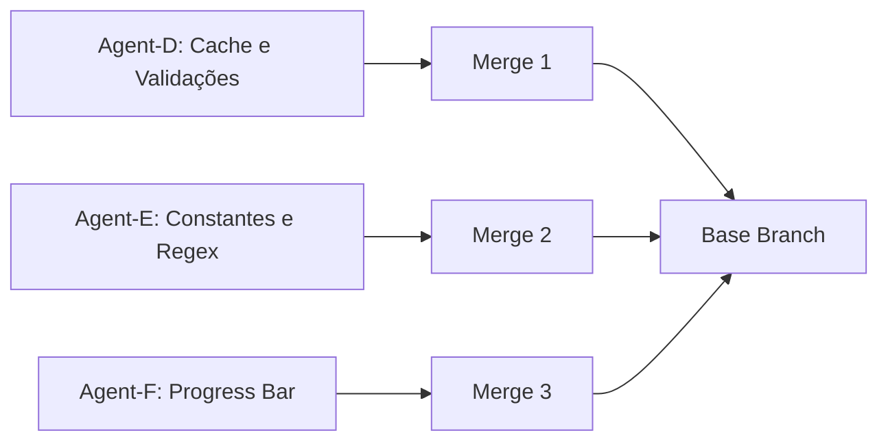

# 📊 Parallel Work Tracker - Wave 2 (Performance)

**Última atualização:** 2025-11-18 (Criação)
**Onda:** Wave-2 (Otimizações de Performance)
**Status geral:** 🟡 EM ANDAMENTO

---

## 📋 Visão Geral da Onda

| Métrica | Valor |
|---------|-------|
| **Total de features** | 3 |
| **Agents ativos** | 3 (Agent-D, Agent-E, Agent-F) |
| **Concluídas** | 0/3 (0%) |
| **Em andamento** | 0/3 |
| **Bloqueadas** | 0/3 |
| **Ganho esperado** | 40-50% performance + UX profissional |
| **Tempo estimado total** | 4-7 horas (paralelo = ~3-4h real) |

---

## 🎯 Agent-D: Cache e Validações (F1-CACHE-VALIDATION)

### Metadados
- **Branch:** `claude/perf-cache-validation-{SESSION_ID}`
- **Prioridade:** 🔴 CRÍTICA
- **Estimativa:** 2-3h
- **Status:** ⚪ Não Iniciado
- **Progresso:** 0%
- **Assignee:** Agent-D
- **Dependências:** Nenhuma

### Entregas

#### 1. Cache de Logo (`@st.cache_resource`)
- [ ] Criar função `carregar_logo()` com decorador
- [ ] Atualizar linha 59-61 para usar função cached
- [ ] Testar: Logo carrega 1 vez por sessão
- [ ] **Ganho:** 30x mais rápido (20-50ms → <1ms)
- **Status:** ⚪ Não iniciado

#### 2. Cache de Extração de Dados (`@st.cache_data`)
- [ ] Criar função `extrair_dados_cached(docx_bytes)`
- [ ] Atualizar interface para pré-processar DOCX
- [ ] Adicionar feedback de equipes encontradas
- [ ] Testar: Re-run instantâneo com mesmo arquivo
- [ ] **Ganho:** 100-250x em re-runs (0.5-2.5s → <10ms)
- **Status:** ⚪ Não iniciado

#### 3. Validação de Tamanho de Arquivos
- [ ] Adicionar constantes MAX_DOCX_SIZE_MB, MAX_PPTX_SIZE_MB
- [ ] Criar função `validar_tamanho_arquivo()`
- [ ] Integrar validações no botão de geração
- [ ] Testar: Arquivo >10MB DOCX rejeitado
- [ ] Testar: Arquivo >20MB PPTX rejeitado
- [ ] **Ganho:** Previne crashes e timeouts
- **Status:** ⚪ Não iniciado

### Checklist de Conclusão
- [ ] Todas as 3 entregas implementadas
- [ ] Testes de validação executados
- [ ] 4 commits realizados (cache logo, cache dados, validações, report)
- [ ] Push para `claude/perf-cache-validation-{SESSION_ID}` realizado
- [ ] REPORT-AGENT-D.md criado e commitado
- [ ] Branch pronta para merge

### Arquivos Modificados
- `APP.py` (linhas ~59-61, nova função cache, validações interface)

### Conflitos Esperados
- **Com Agent-E:** 0% (diferentes seções)
- **Com Agent-F:** 0% (diferentes seções)

---

## 🎯 Agent-E: Constantes e Regex (F2-CONSTANTS-REGEX)

### Metadados
- **Branch:** `claude/perf-constants-regex-{SESSION_ID}`
- **Prioridade:** 🟡 ALTA
- **Estimativa:** 1-2h
- **Status:** ⚪ Não Iniciado
- **Progresso:** 0%
- **Assignee:** Agent-E
- **Dependências:** Nenhuma

### Entregas

#### 1. Aliases como Constantes Globais
- [ ] Criar ALIASES_CAMPOS no topo do arquivo
- [ ] Implementar função `_normalizar_aliases()`
- [ ] Criar ALIASES_NORMALIZADOS e PRIORIDADE_CAMPOS
- [ ] Remover aliases locais de `_identificar_colunas_tabela` (~60 linhas)
- [ ] Atualizar função para usar constantes globais
- [ ] Testar: Matching de colunas funciona igual
- [ ] **Ganho:** 1.5x mais rápido (5-10ms por tabela economizados)
- **Status:** ⚪ Não iniciado

#### 2. Compilação de Regex Patterns
- [ ] Criar seção de REGEX compiladas
- [ ] Definir REGEX_WHITESPACE, REGEX_NON_ALPHANUMERIC, etc.
- [ ] Atualizar `normalizar_texto_base` para usar regex compilada
- [ ] Buscar e atualizar outras funções com regex
- [ ] Testar: Normalização funciona igual
- [ ] **Ganho:** 20-30% em operações de regex
- **Status:** ⚪ Não iniciado

### Checklist de Conclusão
- [ ] Aliases movidos para constantes globais
- [ ] Regex compiladas como constantes
- [ ] `_identificar_colunas_tabela` refatorada
- [ ] `normalizar_texto_base` usa regex compilada
- [ ] Testes de validação executados
- [ ] 3 commits realizados (aliases, regex, report)
- [ ] Push para `claude/perf-constants-regex-{SESSION_ID}` realizado
- [ ] REPORT-AGENT-E.md criado e commitado
- [ ] Branch pronta para merge

### Arquivos Modificados
- `APP.py` (topo do arquivo, `_identificar_colunas_tabela`, `normalizar_texto_base`)

### Conflitos Esperados
- **Com Agent-D:** 0% (diferentes seções)
- **Com Agent-F:** 0% (diferentes seções)

---

## 🎯 Agent-F: Progress Bar e UX (F3-PROGRESS-UX)

### Metadados
- **Branch:** `claude/perf-progress-ux-{SESSION_ID}`
- **Prioridade:** 🟡 ALTA
- **Estimativa:** 1-2h
- **Status:** ⚪ Não Iniciado
- **Progresso:** 0%
- **Assignee:** Agent-F
- **Dependências:** Nenhuma

### Entregas

#### 1. Progress Bar em `gerar_apresentacao`
- [ ] Criar placeholders para progress bar e status
- [ ] Implementar Etapa 1: Carregamento (0-10%)
- [ ] Implementar Etapa 2: Duplicação (10-60%)
- [ ] Implementar Etapa 3: Preenchimento (60-100%)
- [ ] Adicionar auto-limpeza (finally block, 2s)
- [ ] Adicionar tratamento de exceções
- [ ] Testar com 5, 50, 200 equipes
- [ ] **Ganho:** UX profissional, usuário confiante
- **Status:** ⚪ Não iniciado

#### 2. Constantes de Mensagens (OPCIONAL)
- [ ] Adicionar MSG_PROGRESS_* no topo
- [ ] Atualizar função para usar constantes
- **Status:** ⚪ Não iniciado (opcional)

### Checklist de Conclusão
- [ ] Progress bar implementada com 3 etapas
- [ ] Mensagens de status descritivas
- [ ] Porcentagens dinâmicas corretas
- [ ] Auto-limpeza funcionando
- [ ] Funcionalidade preservada (PPTX correto)
- [ ] Testes com diferentes tamanhos
- [ ] 2-3 commits realizados (progress, mensagens se aplicável, report)
- [ ] Push para `claude/perf-progress-ux-{SESSION_ID}` realizado
- [ ] REPORT-AGENT-F.md criado e commitado
- [ ] Branch pronta para merge

### Arquivos Modificados
- `APP.py` (função `gerar_apresentacao`, opcionalmente constantes de mensagens)

### Conflitos Esperados
- **Com Agent-D:** 5-10% (se D modificar interface perto de geração)
- **Com Agent-E:** 0% (diferentes seções)

---

## 📅 Histórico de Eventos

| Data/Hora | Agent | Evento | Detalhes |
|-----------|-------|--------|----------|
| 2025-11-18 | Orchestrator | Criação Wave-2 | Features extraídas, briefings criados |
| - | - | - | - |

*(Agents devem atualizar esta seção ao atingir milestones)*

**Formato de entrada:**
```
| YYYY-MM-DD HH:MM | Agent-X | Milestone | Descrição breve (commit hash se aplicável) |
```

**Milestones importantes:**
- Início do trabalho (branch criada)
- 25% completo (1ª entrega)
- 50% completo (2ª entrega)
- 75% completo (3ª entrega se aplicável)
- 100% completo (push + report)

---

## 🚧 Blockers e Problemas

### Agent-D
*Nenhum blocker reportado ainda*

### Agent-E
*Nenhum blocker reportado ainda*

### Agent-F
*Nenhum blocker reportado ainda*

---

## 🔄 Ordem de Merge



### Estratégia de Merge

**Ordem recomendada:**
1. **Agent-D** (CRÍTICO, zero conflitos esperados)
2. **Agent-E** (ALTO, zero conflitos esperados)
3. **Agent-F** (ALTO, conflitos mínimos possíveis)

**Comandos:**
```bash
# Preparação
git checkout claude/analyze-repository-structure-011CV26eM3noi2SbsiDZJGqW
git pull origin claude/analyze-repository-structure-011CV26eM3noi2SbsiDZJGqW

# Merge 1: Agent-D (Cache)
git fetch origin
git merge --no-ff origin/claude/perf-cache-validation-{SESSION_ID} \
  -m "merge: Agent-D - Cache e Validações (performance)"

# Validar: Testes funcionam, cache ativo

# Merge 2: Agent-E (Constantes)
git fetch origin
git merge --no-ff origin/claude/perf-constants-regex-{SESSION_ID} \
  -m "merge: Agent-E - Constantes e Regex (performance)"

# Validar: Aliases funcionam, regex compiladas

# Merge 3: Agent-F (Progress)
git fetch origin
git merge --no-ff origin/claude/perf-progress-ux-{SESSION_ID} \
  -m "merge: Agent-F - Progress Bar e UX"

# Validar: Progress bar funciona, PPTX gerado corretamente

# Push final
git push origin claude/analyze-repository-structure-011CV26eM3noi2SbsiDZJGqW
```

---

## 📊 Métricas de Sucesso

### Performance (Técnica)

| Métrica | Baseline | Meta Wave-2 | Status |
|---------|----------|-------------|--------|
| Tempo geração (10 equipes) | 700ms | 400ms (-43%) | ⏳ Aguardando |
| Tempo geração (50 equipes) | 3.2s | 1.8s (-44%) | ⏳ Aguardando |
| Tempo geração (200 equipes) | 12.5s | 7.0s (-44%) | ⏳ Aguardando |
| Re-run com cache (logo) | 30ms | <1ms (30x) | ⏳ Aguardando |
| Re-run com cache (dados) | 1.5s | <10ms (150x) | ⏳ Aguardando |

### UX (Qualitativa)

| Métrica | Baseline | Meta Wave-2 | Status |
|---------|----------|-------------|--------|
| Feedback durante geração | ❌ Nenhum | ✅ Progress bar | ⏳ Aguardando |
| Visibilidade de progresso | ❌ 0% | ✅ 100% (0-100%) | ⏳ Aguardando |
| Mensagens de erro | ⚠️ Genéricas | ✅ Específicas | ⏳ Aguardando |
| Validação preventiva | ❌ Nenhuma | ✅ Tamanho de arquivo | ⏳ Aguardando |

---

## 🎯 Critérios de Aceitação da Onda

### Funcional
- [ ] Cache de logo funciona (1 carregamento por sessão)
- [ ] Cache de dados funciona (sem reprocessamento)
- [ ] Validações rejeitam arquivos grandes
- [ ] Aliases são constantes globais
- [ ] Regex são compiladas
- [ ] Progress bar mostra 0-100% corretamente
- [ ] Funcionalidade completa preservada

### Não-Funcional
- [ ] Performance: 40-50% mais rápido em geração
- [ ] Re-runs: 30x mais rápido (logo), 100x+ (dados)
- [ ] UX: Progress bar visível e precisa
- [ ] Código: Mais limpo (constantes globais)
- [ ] Robustez: Validações previnem crashes

### Documentação
- [ ] 3 REPORT-AGENT-*.md criados
- [ ] Commits descritivos em cada branch
- [ ] Este tracker atualizado com eventos
- [ ] Problemas documentados se houver

---

## 🆘 Instruções para Agents

### Ao Iniciar seu Trabalho
1. Atualizar seu status acima: ⚪ → 🔵 EM ANDAMENTO
2. Adicionar entrada no **Histórico de Eventos**
3. Criar sua branch conforme briefing

### Ao Atingir 25%, 50%, 75%
1. Atualizar **Progresso** no seu card
2. Marcar entregas concluídas ([ ] → [x])
3. Adicionar entrada no **Histórico de Eventos**

### Ao Encontrar Blocker
1. Adicionar na seção **Blockers e Problemas**
2. Atualizar status: 🔵 → 🔴 BLOQUEADO
3. Documentar no REPORT pessoal

### Ao Concluir 100%
1. Atualizar status: 🔵 → ✅ CONCLUÍDO
2. Marcar **Progresso:** 100%
3. Verificar **Checklist de Conclusão** completo
4. Adicionar entrada final no **Histórico de Eventos**
5. Criar e commitar REPORT-AGENT-X.md
6. Push para sua branch
7. Notificar orquestrador

---

## 📞 Comunicação

### Canais
- **Report pessoal:** REPORT-AGENT-X.md (em sua branch)
- **Tracker geral:** Este arquivo (atualizar via commit)
- **Blockers urgentes:** Documentar em ambos

### Formato de Atualização

```markdown
## ATUALIZAÇÃO - Agent-X - YYYY-MM-DD HH:MM

**Progresso:** 50%
**Status:** 🔵 EM ANDAMENTO

**Concluído:**
- [x] Entrega 1
- [x] Entrega 2.1

**Em andamento:**
- [ ] Entrega 2.2 (80% completo)

**Próximos passos:**
- Finalizar Entrega 2.2
- Começar Entrega 3

**Blockers:** Nenhum

**ETA:** 30-45 minutos para conclusão
```

---

## 📈 Dashboard Rápido

```
Agent-D (F1-CACHE-VALIDATION)     [⚪⚪⚪⚪⚪⚪⚪⚪⚪⚪] 0%   ⚪ Não iniciado
Agent-E (F2-CONSTANTS-REGEX)      [⚪⚪⚪⚪⚪⚪⚪⚪⚪⚪] 0%   ⚪ Não iniciado
Agent-F (F3-PROGRESS-UX)          [⚪⚪⚪⚪⚪⚪⚪⚪⚪⚪] 0%   ⚪ Não iniciado

Wave-2 Progress: [⚪⚪⚪⚪⚪⚪⚪⚪⚪⚪] 0/3 features (0%)
```

*(Atualizar conforme progresso dos agents)*

---

**Última sincronização:** 2025-11-18 (Criação)
**Próxima revisão:** Após deployment dos agents
**Responsável:** Orchestrator (Claude Code)
